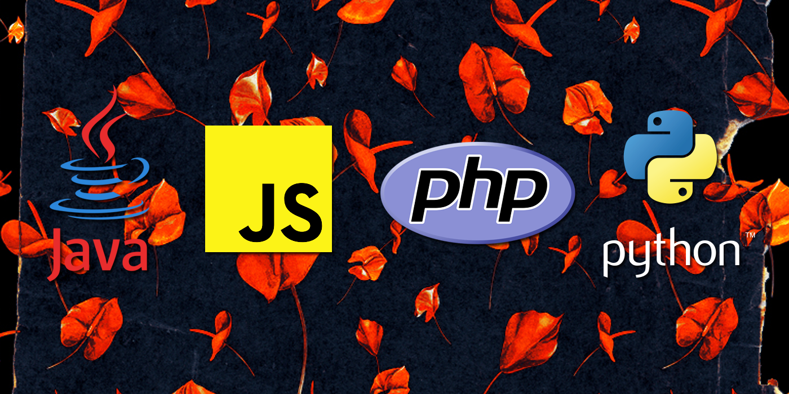
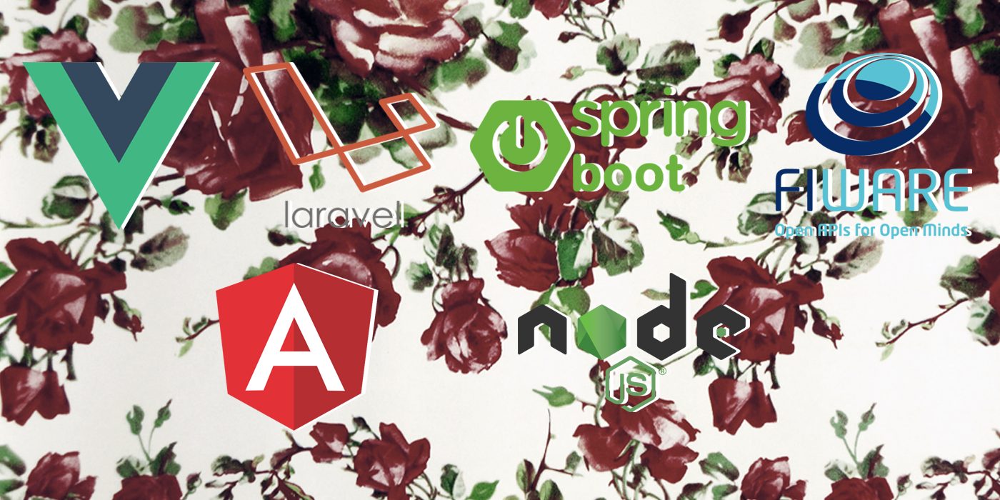
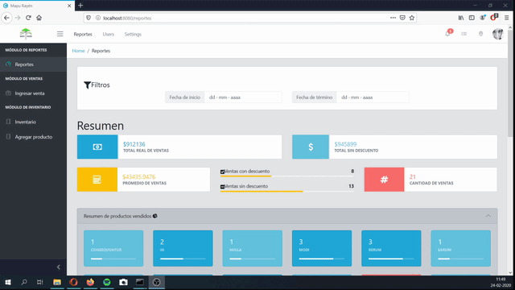
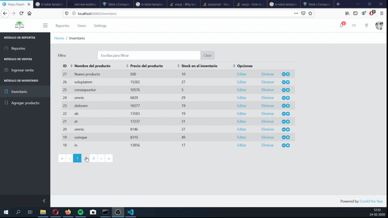
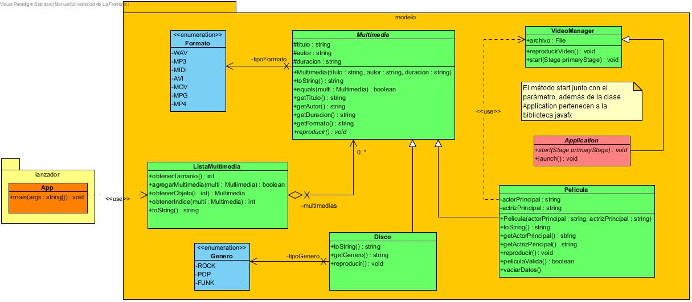

# Manuel Alejandro Espinoza Valenzuela

Estudiante de Ingeniería Civil Informática de quinto año en la Universidad de la Frontera.

## Conocimientos

### Lenguajes de programación

### Frameworks

### En general

- Git
- Docker
- Servicios REST
- Postman
- Bases de datos relacionales y no relacionales

## Repositorios

- [iRecycler](https://github.com/ManuelEV/iRecycler) - gestión de puntos de reciclaje con mapas interactivos [VueJS - Express].

- [Mapu Rayén](https://github.com/ManuelEV/mapu-rayen) - ERP para gestión de inventario y registro de ventas de artesanías [VueJS - Laravel].

- [Reproductor multimedia Java](https://github.com/ManuelEV/ReproductorMultimedia) - Programa reproductor de audio y video realizado en Java.

