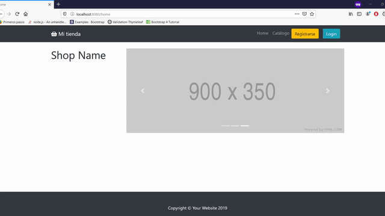

# Manuel Alejandro Espinoza Valenzuela

Estudiante de Ingeniería Civil Informática de sexto año en la Universidad de la Frontera.

## Conocimientos

### Lenguajes de programación

### Frameworks / tecnologías

### En general

- Flutter
- Git
- Docker
- Servicios REST
- Postman
- Bases de datos relacionales y no relacionales

## Repositorios

- [iRecycler](https://github.com/ManuelEV/iRecycler) - gestión de puntos de reciclaje con mapas interactivos [VueJS - Express].

- [Mapu Rayén](https://github.com/ManuelEV/mapu-rayen) - ERP para gestión de inventario y registro de ventas de artesanías [VueJS - Laravel].

- [E-Commerce](https://github.com/ManuelEV/Spring-Ecommerce) - Prototipo de comercio electrónico utilizando navegación por roles [Spring boot - Thymeleaf].

- [Angular Fiware Connection](https://github.com/ManuelEV/Angular-Fiware-Connection) - Conexión a la API de Fiware de Smart Araucanía usando Angular.

- [Spring Security](https://github.com/ManuelEV/Spring-Security-Template) - [Laravel Security (Passport)](https://github.com/ManuelEV/Laravel-Passport-Template)

- [Reproductor multimedia Java](https://github.com/ManuelEV/ReproductorMultimedia) - Programa reproductor de audio y video realizado en Java.

- [Editor imágenes Java](https://github.com/ManuelEV/VisorImagenes) - Editor de imágenes en Java.

- [Análisis de vinos](https://github.com/ManuelEV/wine_analysis/blob/master/Análisis_de_vinos.ipynb) - Análisis de vinos a partir de un dataset, proyecto hecho en Python.